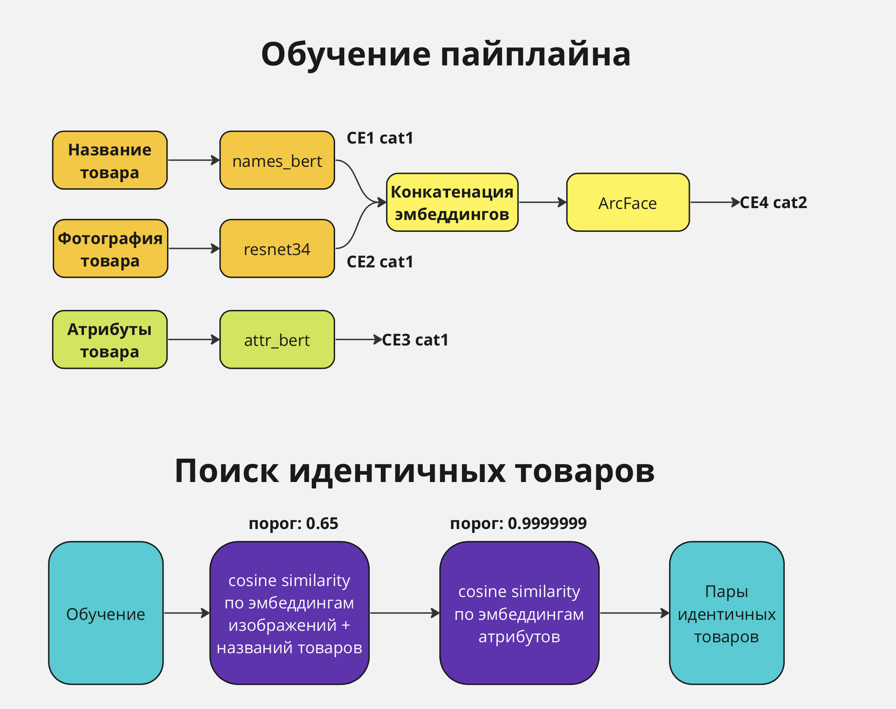
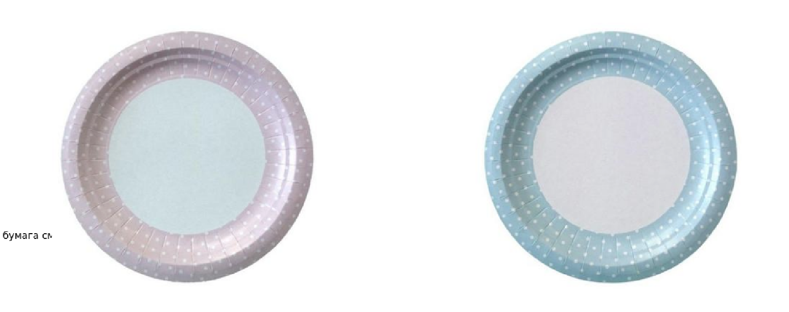
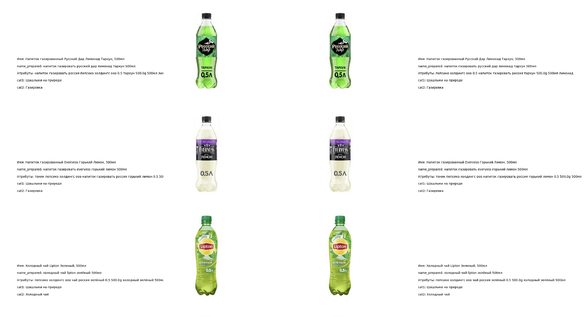
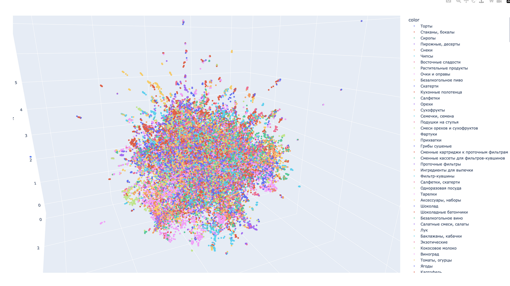
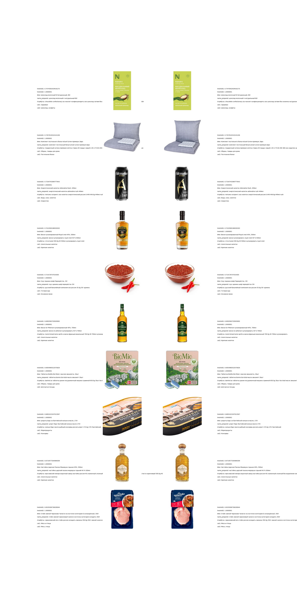

## Идея

Основная идея - получить Prod2Vec  модель, на вход которой подаются данные о товаре: название, характеристики, фотографии, и т.д таким образом, чтобы на выходе мы получили вектор товара максимально описывающий его свойства.

**Зачем это нужно?**  
С помощью таких векторов значительно проще реализовать поиск идентичных товаров, их можно использовать в системе рекомендаций, в поисковом алгоритме и ещё много для чего

## Реализация

Основную идею для реализации мы подчерпнули в статье:  
https://habr.com/ru/companies/ozontech/articles/648231/

Но после реализации пайплайна точь-в-точь, мы столкнулись с проблемой: модель не отличала тонкие характеристики товара (оттенки помады, объем, массу и т.д.). Скорее всего это связано с некачественной предобработкой, либо малым количеством данных (мы обучали на 30к против миллиона у Озона)

Эту проблему мы решили так:

Сам поиск идентичных товаров реализован через cosine\_similarity\_matrix и по порогам отобраны пары товаров.

В интернете встречаются реализации с использованием faiss+KNN. Не пробовали.

## Проблемы

1.  Даже после добавления второго слоя фильтрации товаров по атрибутам встречаются такие пары:

У таких товаров как правило одинаковые названия и одинаковые атрибуты (или отличающиеся одним символом)

Но относительно общего количества товаров, которые находятся моделью, их количество очень мало, поэтому этим можно пренебречь.

2.  Некоторые идентичные товары не проходят по порогам, а при повышении порогов добавляется много мусора. Пример:

Решение: качественная предобработка в данных (особенно по категориям). Подумать, как использовать все фотографии товаров (в пайплайне используется только одна, даже если у товара их несколько)

3.  Оценка качества обучения  
    т.к. разметки в наших данных нет, мы прибегаем к визуальной оценке. Например:

или

такие методы очень трудоёмки, поэтому стоит подумать над введением метрик.

Одна из идей: взять пары, получаемые сравнением имён и считать процент вхождения товаров этой выборки в выборку, получаемую после предсказания пайплайна. Но этот метод имеет очевидный минус - алгоритм сравнивающий имена имеет много ошибок.

## Итог

Мы получили пайплайн, который очень неплохо осуществляет поиск идентичных товаров и собрали систему для получения эмбеддингов товара на сайте.

К сожалению, из-за отсутствия данных для обучения (модель обучалась на данных из Перекрёстка и Ашана) оценить качество сложно. В датасетах присутствует много повторов, мало пересекающихся товаров в Перекрестке и Ашане.

Можно было бы ещё долго стараться улучшать качество на имеющемся датасете, но это привело бы к "переобучению" нашего пайплайна и при появлении новых данных, всё пришлось бы переделывать.

Желаем удачи будущим поколениям ДС в Сарафане. Мы вложили много сил и времени, узнали много нового и надеемся, что наши старания помогут развитию проекта!

## Список литературы

Cnn для эмбеддингов изображений:  
https://www.activeloop.ai/resources/generate-image-embeddings-using-a-pre-trained-cnn-and-store-them-in-hub/

Rubert для векторизации текстов:  
https://habr.com/ru/articles/562064/

Дообучение huggingface туториал:  
https://huggingface.co/docs/transformers/training

3D визуализатор с tsne и umap понижением размерности  
https://projector.tensorflow.org/

ResNet34 cnn  
https://arxiv.org/abs/1512.03385

Примеры проектов:  
https://cyberleninka.ru/article/n/metodika-identifikatsii-obektov-po-unikalnym-harakteristikam-na-izobrazheniyah/viewer  
[https://habr.com/ru/companies/aliexpress\_russia/articles/686672/](https://habr.com/ru/companies/aliexpress_russia/articles/686672/)  
https://habr.com/ru/companies/ozontech/articles/648231/  
https://towardsdatascience.com/learning-product-similarity-in-e-commerce-using-a-supervised-approach-525d734afd99
